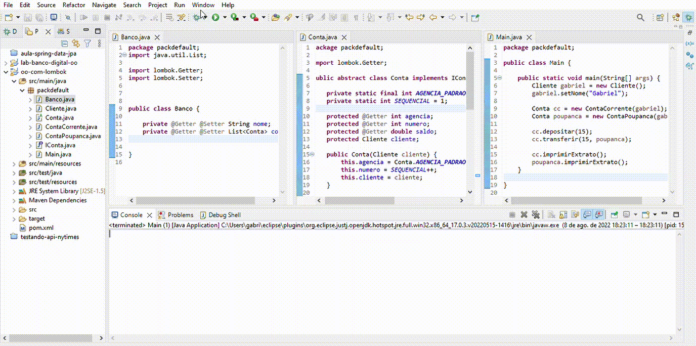

# aula-oo
<h1>Explorando Padrões de Projetos na Prática com Java</h1>

Projeto criado para fixar  Programação Orientada a Objetos explorada durante a aula

# Sobre

Projeto foi desenvolvido reduzir a quantidade de código e observar como o Projeto Lombok ajuda na produtividade

Também foi utilizado o padrão MAVEN para importar a biblioteca ao projeto.

# Resultado

<h1 align="center">
  
</h1>
